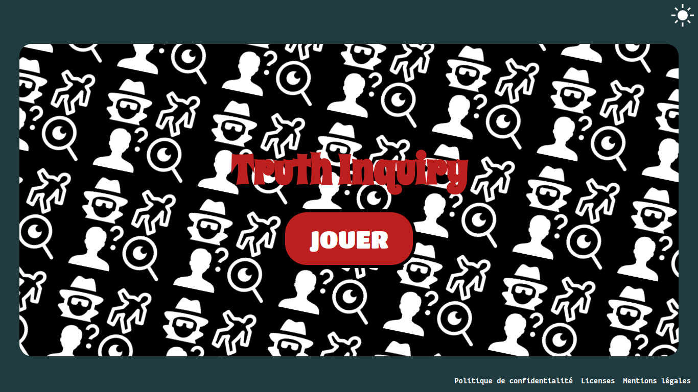
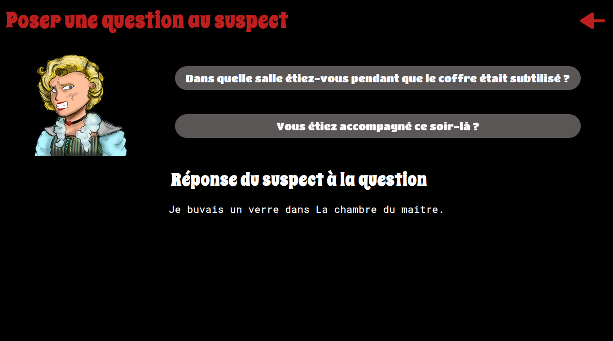
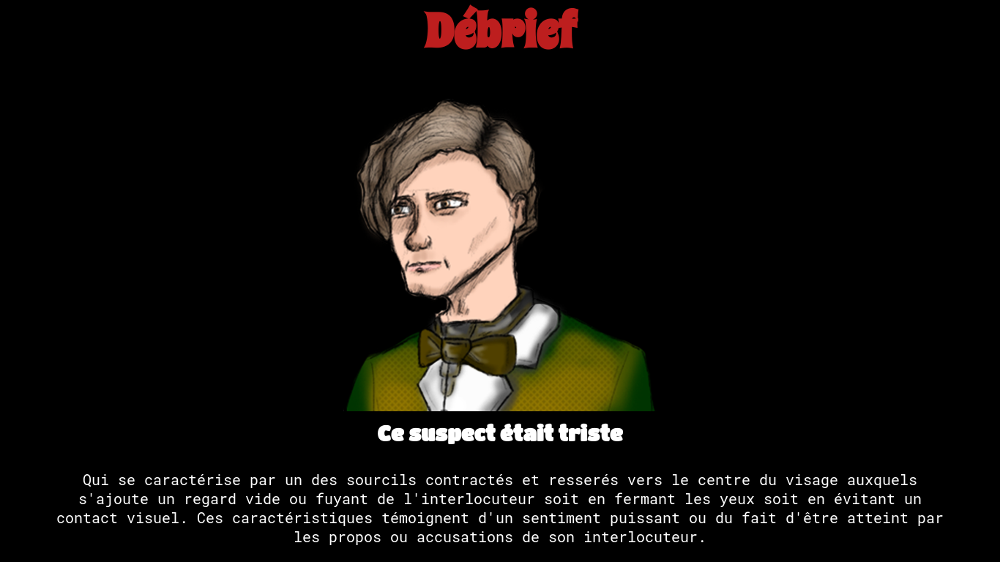

___
<p align="center"> A Simple deduction game based on facial reactions </p>


## Screenshots




___
## How to run

In ordre to run the server you will need ```python3``` and ```python3-pip```. 
Then yo install the depedencies run ```pip install -r requirement.txt```. 

If you want to contribute you may install the dev dependecies as well : ```pip install -r dev-requirement.txt```

To launch the web server just run the command ```flask run```

To run the test run the command ```python -m pytest --verbose```

## Contributors
